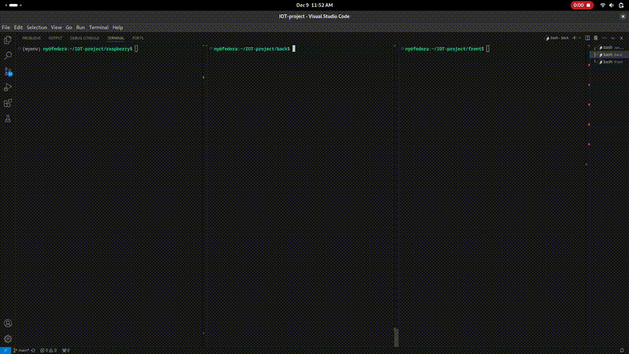

# IOT-project

## 🧊 Smart Fridge Project

This project aims to create a **smart fridge system** using a Raspberry Pi and a camera. The system is designed to analyze the contents of the fridge and provide real-time monitoring through a web application.

### Features:
- **Real-time inventory tracking**: View the current contents of your fridge from anywhere.
- **Custom watchlists**: Set up alerts for specific items you want to track.
- **Real-time notifications**: Get notified immediately if items on your watchlist are missing or running low.

This project helps reduce food waste and ensures you always know what’s in your fridge, making grocery shopping more efficient.





# To run back

## Requirements

### For MacOS and Linux:

```bash
cd back
. myenv/bin/activate
pip install -r requirements.txt
python manage.py runserver
```

### On Windows:

```bash
cd back
python -m venv myenv
myenv\Scripts\activate
pip install -r requirements.txt
python manage.py runserver
```

## Use API

### For MacOS and Linux:

```bash
curl -X POST http://127.0.0.1:8000/inventory/api/update-food-items/ -H "Content-Type: application/json" -d '[{"name": "Tomatoes", "quantity": 5}, {"name": "Milk", "quantity": -2}]'
```

### On Windows:

```bash
$headers = @{ "Content-Type" = "application/json" }
$data = '[{"name": "Tomatoes", "quantity": 5}, {"name": "Milk", "quantity": 2}]'

Invoke-WebRequest -Uri "http://127.0.0.1:8000/inventory/api/update-food-items/" `
                  -Method POST `
                  -Headers $headers `
                  -Body $data
```

# To run front

```bash
npm install
npm run dev
```


# To run raspberry pi
```bash
cd raspberry
python3.10 -m venv myenv
. myenv/bin/activate
pip install -r requirements.txt
python3.10 raspberry.py
```